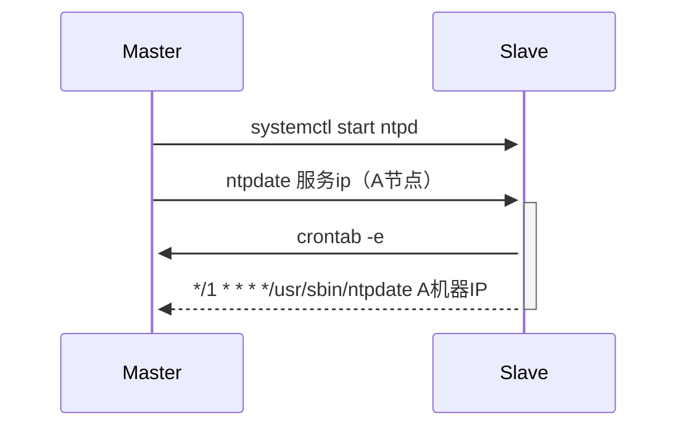

[TOC]

> master 全执行   node 执行到 3.2

### 一、环境准备（关闭防火墙，selinux，swarp）

######    1.1 集群相关机器添加互信【有互信需求的都添加】

```shell
   ssh-keygen  #生成秘钥文件
   ssh-copy-id -i ~/.ssh/id_rsa.pub root@目标IP
```

######    1.2 关闭防火墙

```shell
systemctl stop firewalld && systemctl disable firewalld
```

###### 1.3 关闭selinux

```shell
sed -i 's/^SELINUX=enforcing$/SELINUX=disabled/' /etc/selinux/config && setenforce 0
#查看selinux具体情况：
getenforce
```

###### 1.4 关闭swarp

```shell
swapoff -a      #临时关闭
sed -i 's/.swap./#&/' /etc/fstab  #永久关闭，在文件中添加注释
```

###### 1.5  配置内核参数与路由转发

```shell
echo "net.ipv4.ip_forward = 1" >> /etc/sysctl.conf
echo "net.bridge.bridge-nf-call-ip6tables = 1" >> /etc/sysctl.conf
echo "net.bridge.bridge-nf-call-iptables = 1" >> /etc/sysctl.conf
echo "net.ipv6.conf.all.disable_ipv6 = 1" >> /etc/sysctl.conf
echo "net.ipv6.conf.default.disable_ipv6 = 1" >> /etc/sysctl.conf
echo "net.ipv6.conf.lo.disable_ipv6 = 1" >> /etc/sysctl.conf
echo "net.ipv6.conf.all.forwarding = 1"  >> /etc/sysctl.conf
# 执行命令以生效
sysctl -p
```

更改proxy转发策略为ipvs 

```shell
 cat > /etc/sysconfig/modules/ipvs.modules <<EOF
#!/bin/bash
modprobe -- ip_vs
modprobe -- ip_vs_rr
modprobe -- ip_vs_wrr
modprobe -- ip_vs_sh
modprobe -- nf_conntrack_ipv4
EOF

#赋权运行
chmod 755 /etc/sysconfig/modules/ipvs.modules
sh /etc/sysconfig/modules/ipvs.modules
```

查看策略结果：

```
lsmod | grep -e ip_vs -e nf_conntrack_ipv4
```

###### 1.6 修改 hostname   并执行 vim/etc/hosts    

 增加  ip     hostname   centos

```
master节点  vim /etc/net.conf  
restrict 192.168.0.0 mask 255.255.255.0 nomodify  #配置下游服务器可以使用该服务的IP网段
 #配置上游NTP服务器IP地址 
server cn.pool.ntp.org 
#外部时间服务器不可用时，以本地时间作为时间服务 
server 127.127.1.0 #local clock 
fudge 127.127.1.0 stratum 3

vim  /etc/sysconfig/ntpd       #保证BIOS(主板)与系统时间同步
```



###### 1.7 创建 kubernetes的yum源

```shell
cat <<EOF > /etc/yum.repos.d/kubernetes.repo
[kubernetes]
name=Kubernetes
baseurl=https://mirrors.aliyun.com/kubernetes/yum/repos/kubernetes-el7-x86_64
enabled=1
gpgcheck=0
repo_gpgcheck=0
gpgkey=https://mirrors.aliyun.com/kubernetes/yum/doc/yum-key.gpg https://mirrors.aliyun.com/kubernetes/yum/doc/rpm-package-key.gpg
EOF
```

### 二、安装docker配置

######  2.1 docker 安装

安装需要的包
yum install -y yum-utils device-mapper-persistent-data lvm2

docker 删除旧版本
yum remove docker  docker-common docker-selinux docker-engine

添加阿里云的源
yum-config-manager --add-repo http://mirrors.aliyun.com/docker-ce/linux/centos/docker-ce.repo

查看所有仓库中所有docker版本
yum list docker-ce --showduplicates | sort -r

安装需要的版本

yum install docker-ce-19.03

systemctl restart docker

systemctl enable docker

```shell
vim /etc/docker vim daemon.json
{
"registry-mirrors": ["http://373a6594.m.daocloud.io"],
"insecure-registries": ["自己本地库IP:5000"],
"exec-opts": ["native.cgroupdriver=systemd"],
"data-root":"/data/docker",
"bip": "10.188.0.1/16",
"log-driver": "json-file",
 "storage-driver": "overlay2",
"log-opts": { "max-size": "64m", "max-file": "3"}
}
```

###### 2.2 安装nfs(service模块只需要主节点安装一个就好)

```shell
# 检查一下nfs有没有安装，主流linux发行版应该有预装
yum install -y nfs-utils
选一台机器安装nfs server。
# 创建文件夹，注意把数据盘挂到/data目录
mkdir -p /data/nfs
# 修改目录权限
chmod -R 666 /data/nfs
# 修改/etc/exports
/data/nfs     *(rw,sync,insecure,no_subtree_check,no_root_squash)
# 启动nfs
systemctl enable --now nfs-server.service
#检查nfs server运行状态
systemctl status nfs-server.service
#添加开机自启  
systemctl enable nfs-server.service 
```

###### 2.3 	检查是否安装regesitry

\#检查是否有安装

​    docker ps -a | grep registry

   \#如果没有安装则使用下面命令安装

docker pull  registry:2.7  或 docker run -d --name registry -v /data/registry:/var/lib/registry --network host registry:2.7

### 三、安装kubenetes

###### 3.1 三组件安装 kubectl  kubeadm   kubelet

```shell
yum install -y kubelet-1.16.3 kubeadm-1.16.3 kubectl-1.16.3
chmod +x kubectl &&
mv kubectl /usr/local/bin
#卸载管理组件
yum erase -y kubelet kubectl kubeadm
启用kubectl命令的自动补全功能：
echo "source <(kubectl completion bash)" >> ~/.bashrc
```

###### 3.2 修改kubectl配置文件

```shell
vim /etc/sysconfig/kubelet
KUBELET_EXTRA_ARGS=--root-dir=/data/kubelet --feature-gates SupportPodPidsLimit=false --feature-gates SupportNodePidsLimit=false --cgroup-driver=systemd
```

```
启动kebelet,并设置开机自启动
systemctl enable kubelet && systemctl start kubelet
```

###### 3.4 k8s 生成初始化文件并修改配置文件   kubeadm config print init-defaults > kubeadmin-config.yaml


######  3.5所需镜像列表

- calico/node:v3.10.4
- calico/cni:v3.10.4
- calico/kube-controllers:v3.10.4
- calico/pod2daemon-flexvol:v3.10.4
- registry.cn-hangzhou.aliyuncs.com/google_containers/kube-proxy:v1.18.3
- registry.cn-hangzhou.aliyuncs.com/google_containers/kube-apiserver:v1.18.3
- registry.cn-hangzhou.aliyuncs.com/google_containers/kube-scheduler:v1.18.3
- registry.cn-hangzhou.aliyuncs.com/google_containers/kube-controller-manager:v1.18.3
- registry.cn-hangzhou.aliyuncs.com/google_containers/pause:3.2
- registry.cn-hangzhou.aliyuncs.com/google_containers/coredns:1.6.7
- registry.cn-hangzhou.aliyuncs.com/google_containers/etcd:3.4.3-0

使用 docker images pull 拉取

 daemon.json  registries  改为 自己本机ip:5000

使用 docker tag  修改 成  192.168.200.128:5000/pause:3.1  格式

 给 calico 和 kubeadm-images-1.16.3 镜像打tag   改为  ip:5000/name:version

改完 就 docker push   ip:5000/name:version 

使用 curl http://ip:5000/v2/_catalog   查看push 了 多少库

######  3.5.1 镜像内部存储【安装nfs】

```yaml
replicaCount: 1
nfs:
  server: 配置的仓库ip
  path: /data/nfs
storageClass:
  name: nfs
  defaultClass: true
  reclaimPolicy: Delete
```

helm install  nfs-client-provisioner charts/nfs-client-provisioner-1.3.0.tar.gz -f  路径/name.yaml -n nfs --create-namespace

###### 3.6 初始化k8s 

```
 kubeadm init --config=kubeadmin-config.yaml --upload-certs |tee kubeadm-init.log
    失败可以使用 kubeadm reset 
 成功执行
 mkdir -p $HOME/.kube
  sudo cp -i /etc/kubernetes/admin.conf $HOME/.kube/config
  sudo chown $(id -u):$(id -g) $HOME/.kube/config   

```

###### 3.7 安装calico

 安装calico前先修改kubernetes配置：

```
vim /etc/kubernetes/manifests/kube-apiserver.yaml 
添加     - --service-node-port-range=1-65535
```

配置完执行  kubectl apply -f calico.yaml

###### 3.8  节点加入master集群

master 执行 

```
kubeadm token create --print-join-command     加上--ttl 0  token永久生效
生成 token 有代码 可执行    kubeadm token list 列出token

子节点执行 从master 生成的.kube/config   复制到子节点中  执行加入环境变量
echo "export KUBECONFIG=./config" >> /etc/profile
source /etc/profile
然后就可以执行 kubectl命令  比如bukectl get nodes


操作步骤

  daemon.json  registries  改为 自己本机ip：5000

给 calico 和 kubeadm-images-1.16.3 镜像打tag   改为  ip:5000/name:version

改完 就 docker push   ip:5000/name:version


curl http://ip:5000/v2/_catalog   查看push 了 多少

```

###  k8s中yaml格式解析

```yaml
1. \# yaml格式的pod定义文件完整内容：

apiVersion: v1       #必选，版本号，例如v1
kind: Pod       #必选，Pod
metadata:       #必选，元数据
  name: string       #必选，Pod名称
  namespace: string    #必选，Pod所属的命名空间
  labels:      #自定义标签
    - name: string     #自定义标签名字
  annotations:       #自定义注释列表
    - name: string
spec:         #必选，Pod中容器的详细定义
  containers:      #必选，Pod中容器列表
  - name: string     #必选，容器名称
    image: string    #必选，容器的镜像名称
    imagePullPolicy: [Always | Never | IfNotPresent] #获取镜像的策略 Alawys表示下载镜像 IfnotPresent表示优先使用本地镜像，否则下载镜像，Nerver表示仅使用本地镜像
    command: [string]    #容器的启动命令列表，如不指定，使用打包时使用的启动命令
    args: [string]     #容器的启动命令参数列表
    workingDir: string     #容器的工作目录
    volumeMounts:    #挂载到容器内部的存储卷配置
    - name: string     #引用pod定义的共享存储卷的名称，需用volumes[]部分定义的的卷名
      mountPath: string    #存储卷在容器内mount的绝对路径，应少于512字符
      readOnly: boolean    #是否为只读模式
    ports:       #需要暴露的端口库号列表
    - name: string     #端口号名称
      containerPort: int   #容器需要监听的端口号
      hostPort: int    #容器所在主机需要监听的端口号，默认与Container相同
      protocol: string     #端口协议，支持TCP和UDP，默认TCP
    env:       #容器运行前需设置的环境变量列表
    - name: string     #环境变量名称
      value: string    #环境变量的值
    resources:       #资源限制和请求的设置
      limits:      #资源限制的设置
        cpu: string    #Cpu的限制，单位为core数，将用于docker run --cpu-shares参数
        memory: string     #内存限制，单位可以为Mib/Gib，将用于docker run --memory参数
      requests:      #资源请求的设置
        cpu: string    #Cpu请求，容器启动的初始可用数量
        memory: string     #内存清楚，容器启动的初始可用数量
    livenessProbe:     #对Pod内个容器健康检查的设置，当探测无响应几次后将自动重启该容器，检查方法有exec、httpGet和tcpSocket，对一个容器只需设置其中一种方法即可
      exec:      #对Pod容器内检查方式设置为exec方式
        command: [string]  #exec方式需要制定的命令或脚本
      httpGet:       #对Pod内个容器健康检查方法设置为HttpGet，需要制定Path、port
        path: string
        port: number
        host: string
        scheme: string
        HttpHeaders:
        - name: string
          value: string
      tcpSocket:     #对Pod内个容器健康检查方式设置为tcpSocket方式
         port: number
       initialDelaySeconds: 0  #容器启动完成后首次探测的时间，单位为秒
       timeoutSeconds: 0   #对容器健康检查探测等待响应的超时时间，单位秒，默认1秒
       periodSeconds: 0    #对容器监控检查的定期探测时间设置，单位秒，默认10秒一次
       successThreshold: 0
       failureThreshold: 0
       securityContext:
         privileged:false
    restartPolicy: [Always | Never | OnFailure]#Pod的重启策略，Always表示一旦不管以何种方式终止运行，kubelet都将重启，OnFailure表示只有Pod以非0退出码退出才重启，Nerver表示不再重启该Pod
    nodeSelector: obeject  #设置NodeSelector表示将该Pod调度到包含这个label的node上，以key：value的格式指定
    imagePullSecrets:    #Pull镜像时使用的secret名称，以key：secretkey格式指定
    - name: string
    hostNetwork:false      #是否使用主机网络模式，默认为false，如果设置为true，表示使用宿主机网络
    volumes:       #在该pod上定义共享存储卷列表
    - name: string     #共享存储卷名称 （volumes类型有很多种）
      emptyDir: {}     #类型为emtyDir的存储卷，与Pod同生命周期的一个临时目录。为空值
      hostPath: string     #类型为hostPath的存储卷，表示挂载Pod所在宿主机的目录
        path: string     #Pod所在宿主机的目录，将被用于同期中mount的目录
      secret:      #类型为secret的存储卷，挂载集群与定义的secre对象到容器内部
        scretname: string  
        items:     
        - key: string
          path: string
      configMap:     #类型为configMap的存储卷，挂载预定义的configMap对象到容器内部
        name: string
        items:
        - key: string
          path: string

```


