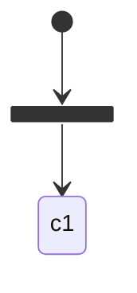
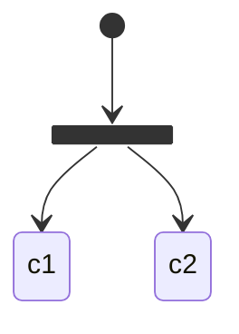
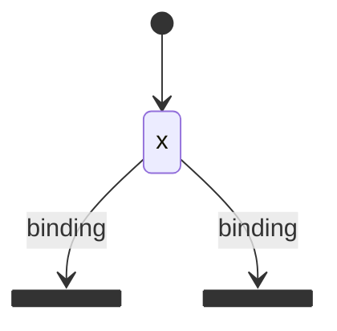
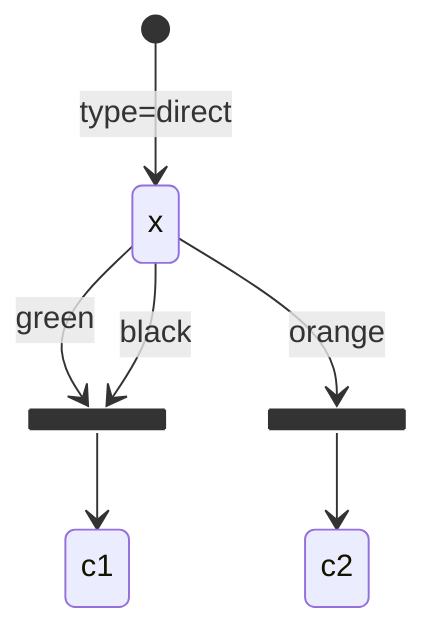
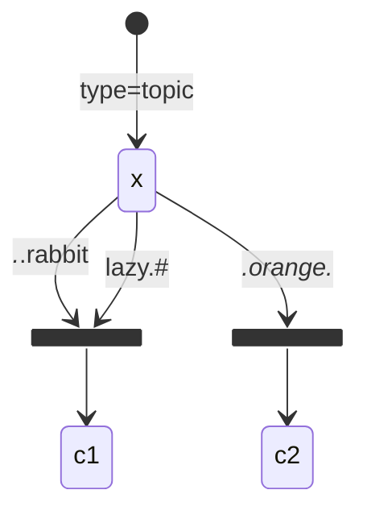
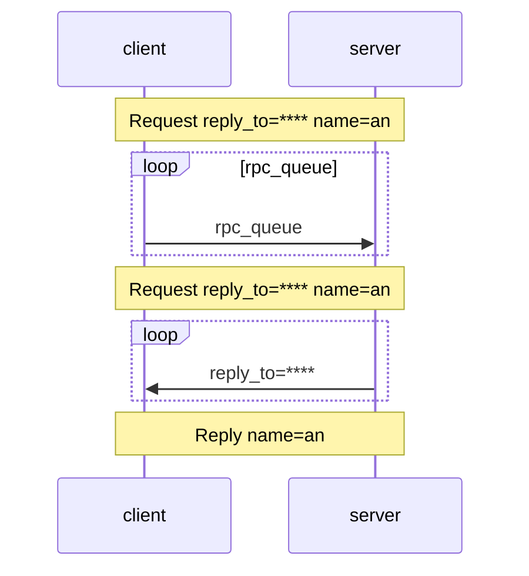

### rabbitMQ六种模式

[RabbitMQ - 简书 (jianshu.com)](https://www.jianshu.com/p/77db66311d32)  rabbitMQ 笔记

##### 1.simple简单模式




##### 2.work工作模式




##### 3.Publish/Subscribe  发布订阅模式



##### RabbitMq 注册   // 可在虚拟机中 使用docker 启动rabbitMQ

```go
package Mq

import (
	"github.com/streadway/amqp"
	"log"
)

func RabbitConn()(conn *amqp.Connection){
	 user :="admin"
	 pwd :="admin"
	host :="192.168.200.128"
	port :="5672"
	url:="amqp://"+user+":"+pwd+"@"+host+":"+port+"/"
	//建立连接
	conn, err := amqp.Dial(url)
	if err !=nil{
		log.Fatalf("amqp.dial 连接错误: %v",err)
	}
	return conn
}

```


#####  consumer

```go
package main

import (
	"log"
	"rabbitMQ/Mq"
	"time"
)

// consumer
func main() {

	conn:= Mq.RabbitConn()
	defer conn.Close()

	forever := make(chan bool)
	for i := 0; i < 10; i++ {
		go func(num int) {
			// 获取通道  所有操作通过 通道控制
			ch,err:=conn.Channel()
			if err !=nil{
				log.Fatalf("获取通道失败 conn.channel err: %v",err)
			}
			defer ch.Close()
			//  队列申明
			q,err:=ch.QueueDeclare(
				"an",
				false,    // true 数据表示持久化存储
				false,
				false,
				false,
				nil,
			)
			if err !=nil{
				log.Fatalf("队列申明失败 ch.QueueDeclare err: %v",err)
			}
			// 设置每次从消息队列获取的数量
			err =ch.Qos(
				1, // 预取任务 数量
				0,  // 预取大小
				false,   // 全局 设置
			)
			if err !=nil{
				log.Fatal(err)
			}
			//消费者接收消息 msg为 只读通道
			msgs,err:=ch.Consume(q.Name,"",true,false,false,false,nil)
			if err !=nil{
				log.Fatalf("ch.Consume err :%v",err)
			}
			for msg := range msgs {
				log.Printf("协程 %d   Received a message: %s",num ,msg.Body)
				time.Sleep(2*time.Second)
				//err=msg.Ack(true)
				//if err !=nil{
				//	log.Fatalf("msg.Ack err: %v",err)
				//}
			}
		}(i)
	}

	<-forever

}

```

##### produce 1

```go
package main

import (
	"fmt"
	"github.com/streadway/amqp"
	"log"
	"rabbitMQ/Mq"
)

func main() {
	conn:= Mq.RabbitConn()
	defer conn.Close()

	// 获取通道  所有操作通过 通道控制
	ch,err:=conn.Channel()
	if err !=nil{
		log.Fatalf("获取通道失败 conn.channel err: %v",err)
	}
	//  队列申明
	q,err:=ch.QueueDeclare(
		"an",
		false,    // true 数据表示持久化存储
		false,
		false,
		false,
		nil,
		)
	if err !=nil{
		log.Fatalf("队列申明失败 ch.QueueDeclare err: %v",err)
	}
	// 发送消息
	for i := 0; i < 100; i++ {
		body := fmt.Sprintf("{\"order_id\":%d}",i)
		fmt.Println(body)
		err =ch.Publish(
			"",
			q.Name,
			false,
			false,
			amqp.Publishing{
				ContentType: "text:plain",
				Body: []byte(body), // 消息的内容
			},
		)
		if err !=nil{
			log.Fatalf("发送消息失败: %v",err)
		}
	}


}

```


##### produce 2

```go
package main

import (
	"fmt"
	"github.com/streadway/amqp"
	"log"
	"rabbitMQ/Mq"
)

func main() {
	conn:= Mq.RabbitConn()
	defer conn.Close()

	// 获取通道  所有操作通过 通道控制
	ch,err:=conn.Channel()
	if err !=nil{
		log.Fatalf("获取通道失败 conn.channel err: %v",err)
	}
	//  队列申明
	q,err:=ch.QueueDeclare(
		"an",
		false,    // true 数据表示持久化存储
		false,
		false,
		false,
		nil,
	)
	if err !=nil{
		log.Fatalf("队列申明失败 ch.QueueDeclare err: %v",err)
	}
	// 发送消息
	for i := 0; i < 100; i++ {
		body := fmt.Sprintf("{\"task_id\":%d}",i)
		fmt.Println(body)
		err =ch.Publish(
			"",
			q.Name,
			false,
			false,
			amqp.Publishing{
				ContentType: "text:plain",
				Body: []byte(body), // 消息的内容
			},
		)
		if err !=nil{
			log.Fatalf("发送消息失败: %v",err)
		}
	}


}

```


##### 4.Routing 路由模式




##### 5.Topics 主题模式（路由模式的一种)




##### 6.RPC



